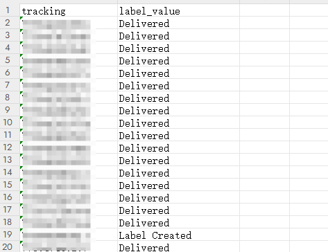

# Fedex Tracking Bot

English | [中文](./README_CN.md)

## Overview

This project is designed to automate the process of tracking shipment statuses using tracking numbers from an Excel file. By leveraging web scraping techniques, the program fetches real-time tracking information from the FedEx website and stores the results in a new Excel file.

## Features

- **Automated Tracking**: Automatically fetches tracking statuses for a list of shipment numbers.
- **Concurrent Processing**: Utilizes multithreading to process multiple tracking numbers simultaneously, improving efficiency.
- **Proxy Support**: Supports proxy settings to ensure anonymity and bypass regional restrictions.
- **Error Handling**: Includes retry mechanisms to handle temporary network issues or website unavailability.

## Requirements

- Python 3.x
- Selenium
- BeautifulSoup
- pandas
- openpyxl
- A valid ChromeDriver executable in the project directory

## Setup

1. Install the required Python packages:

2. Download and place the ChromeDriver executable in the project directory.

3. Edit the `.env` file in the project directory
   ```plaintext
   # The name of the input Excel file containing tracking numbers
   INPUT_FILE=input_example.xlsx

   # The proxy address used for the web requests. If a proxy is not needed, leave this parameter empty.
   PROXY_ADDRESS=socks5://127.0.0.1:8443

   # The maximum number of concurrent workers for processing
   MAX_WORKERS=10
   
   # The path of chromedriver.exe
   CHROME_DRIVER_PATH=./chromedriver.exe
   ```

4. Run the script:
   ```bash
   python main.py
   ```

## Usage

- Ensure that the input Excel file specified in the `.env` file is present in the project directory.
- The script will generate an output Excel file with tracking results, named `tracking_resultsN.xlsx`.

## Notes

- Make sure the ChromeDriver version matches your installed Chrome browser version.
- Adjust the `MAX_WORKERS` setting in the `.env` file according to your system's capabilities for optimal performance.
- Excessive requests (typically around 100 queries) may result in temporary access bans. It is recommended to use the [glider project](https://github.com/nadoo/glider) to convert multiple proxy nodes into a proxy pool.
- If no proxy is needed, leave the PROXY_ADDRESS parameter empty in the environment; however, the number of queries will be limited.

---

## Result
